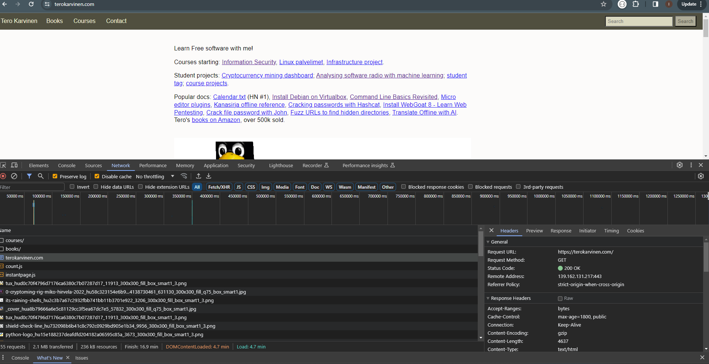

#Alkutesti
Liikenteen sieppaus ja analysointi:
Googlen haun tuloksena löysin entisen opiskelijan blogin, jonka ansiosta sain ymmärrystä tehtävän annosta. 
Kyseinen blogi: https://susannalehto.fi/2023/tunkeutumistestaus-alkutesti-h0/

Kohteena käyntän terokarvinen.com sivustoa ja työkaluna chromen dev.tools.
Netvork välilehdeltä pääsin seuraamaan verkkoliikenteen kautta tapahtuvaa toimintaa.

Verkkoraporttia suratessa huomasin että ensimmäisenä selain latasi courses/ ja books/ html tiedostot ja sen jälkeen varsinaisen terokarvinen.com sivuston. 
Kaikki kolme tiedostoa ovat :
-html tyyppisiä dokumentteja
-GET pyyntöä käyttävä toimintoa
-Status Code on näilä kolmella tiedostolla on 200, mikä taroittaa sitä, että tiedostijen hakemisen yhteydessä ei ole tapahtunut virheitä.
-Remote Adressina on kaikilla sama osoite ***************

