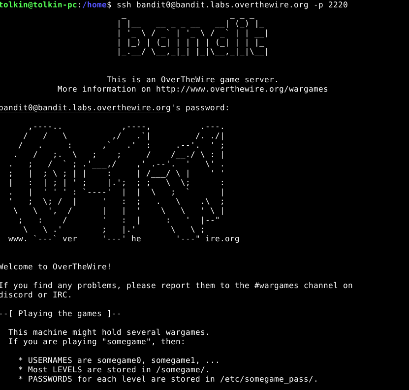

## OverTheWire


Päätin suorittamaan kyseiset tehtävät käyttäen Debian GNU/Linux v10(buster), joka pyörii VirtualBox 7.0 ssa.
Aluksi tutustuin overthewire.org sivustolla esitettyihin dokumentaatiohin muistin virkistämiseksi: 
    https://www.wikihow.com/Use-SSH
    ja 
    https://en.wikipedia.org/wiki/Secure_Shell

### a) 
tehtävän 0 suorittaminen on ollut yksinkertaista ja helppoa.
tarkoituksena on kirjautua bandit.labs.overthewire.org käyttäen bandit0 käyttäjää.

Ensimmäinen ongelma johon törmäsin oli SSH Clientin puute.


Clientin asentamiseen ei mennyt kuin 1-2 min. Kyseinen ongelma ratkesi tällä kommennolla
```
sudo apt install openssh-client
``` 
Clientin asennettua minä pääsin kirjautumaan: 
```
ssh bandit0@bandit.labs.overthewire.org
```
Kyseinen käsky ei kuitenkaan toiminut sillä en ole erikseen maininut porttia, joka on 2220
```
ssh bandit0@bandit.labs.overthewire.org -p 2220
```
sen jälkeen minulta kysyttiin salasanaa, jonka annettua pääsin sisään



