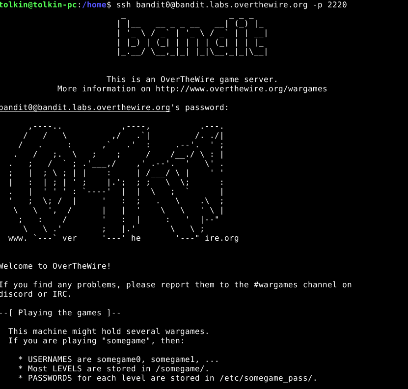

## OverTheWire

Päätin suorittamaan kyseiset tehtävät käyttäen Debian GNU/Linux v10(buster), joka pyörii VirtualBox 7.0 ssa.
Aluksi tutustuin overthewire.org sivustolla esitettyihin dokumentaatiohin muistin virkistämiseksi: 
    https://www.wikihow.com/Use-SSH
    ja 
    https://en.wikipedia.org/wiki/Secure_Shell

## a)

### 0
tehtävän 0 suorittaminen on ollut yksinkertaista ja helppoa.
tarkoituksena on kirjautua bandit.labs.overthewire.org käyttäen bandit0 käyttäjää.

Ensimmäinen ongelma johon törmäsin oli SSH Clientin puute.

Clientin asentamiseen ei mennyt kuin 1-2 min. Kyseinen ongelma ratkesi tällä kommennolla

    sudo apt install openssh-client

Clientin asennettua minä pääsin kirjautumaan käyttäen valmiiksi annettuja portin nro, käyttäjän nimeä: 

    ssh bandit0@bandit.labs.overthewire.org -p 2220

sen jälkeen minulta kysyttiin salasanaa, jonka annettua pääsin sisään

### 0 -> 1

Toisena tehtävänä on lukea readme tiedoston, jossa on salasana
Siihen on käytetty seuraavia käskyjä:

    ls
    file readme
    cat readme
   
ls käsky tulostaa hakemiston sisällön, file <file> tulostaa tiedoston tyypin ja cat <file> tulostaa tiedoston sisällön.

    ssh bandit1@bandit.labs.overthewire.org -p 2220

käskyn suoritettua kysyttiin redme tiedostossa olevaa salasanaa, jonka annettua pääsi sisään

### 1 -> 2

Kolmantena tehtävänä on lukea tiedoston, joka on nimetty "-" merkillä. Kyseisen tiedoston saa luettua antamalla polun kyseiseen tiedostoon.

    ls
    file ./-
    cat ./-

### 2 -> 3

Seuraavassa tehtävässä on tarkoituksena lukea tiedosto, jonka nimessä on käytetty välilyöntejä. 
Kyseisen ongelman ratkaisemiseen voi käyttää kahta erilaista tapaa.

Tapa 1:
yksikertainen tapa olla käsitellä tiedostoa on kääriä tiedoston nimen "" tai '' merkkeihin <"spaces in this filename">

    ls
    file 'spaces in this filename'
    cat 'spaces in this filename'

Tapa 2: 
vähän enemmän työtä vaativa tapa on lisätä jokaisen välilyönnin eteen \ merkin <spaces\ in\ this\ filename>

    ls
    file spaces\ in\ this\ filename
    cat spaces\ \in \this\ filename
