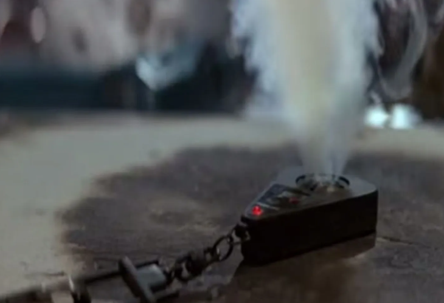

## Generation Z Hack Challenge

Kyseisen haasteiden valikoimasta päätin ottaa "Antagonist's artistic ancestor'.

Tehtävän annossa on tekstiä: 

-This is a device used by an agent in an alternate universe who is licensed to kill.

-The actor of his antagonist, of the said movie the device was used in, is a grandson of a famous painter.

-This famous painter belonged to an artistic society. What is the street address of this artistic society's building today?

Ja liitteenä kuva:

Vihjeena: 
-Reverse image search might be a good idea.

Käytin Googlen image search työkalua. Haun tuloksena selvisi että kyseessä on James Bond The Living Daylights elokuvan avaimenperä, joka sisältää erilaisia toiminnallisuuksia.
Kyseisen elokuvan yksi vihollista näyttellyt näyttelijä on Jaroen Krabbe.

    https://www.imdb.com/title/tt0093428/
    https://en.wikipedia.org/wiki/Jeroen_Krabb%C3%A9
    https://en.wikipedia.org/wiki/Hendrik_Maarten_Krabb%C3%A9

Wikipediasta selviää että kyseisen näyttelijän isovanhempi oli hollantilainen taitelija Hendrik Maarten Krabbe, joka oli Arti et Amicitiae pitkä-aikainen jäsen. 

    https://www.arti.nl/english/

Osoite selviää sivuston alalaidasta.
Rokin 112

Tehtävän ratkaisuksi asetetaan GENZ{Rokin_112}

