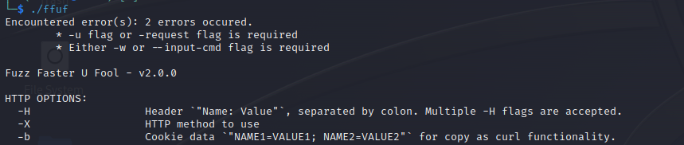

# Still Fuzzing Faster

- web fuzzing avulla voidaan syöttää erilaista dataa web-serverille ja yrittää havaita poikkeavuksia saaduista vastauksista.

Fuzz syötteitä voidaan asettaa:
- http pyynnön URLissa (poikkeavuden havaitsemiseksi)
- http pyynnön Host: ositteessa (subdomainien selvittämiseen)

### Tehtävä kesken

 

# ffuf - fuzzing exercise
## a)
Suoritan harjoituksen Kali GNU/Linux Rolling 2023.3, joka on asennettu VirtualBox v7.0. Selaimena Mozilla Firefox 115.1.0esr

Suoritin tehtävän käyttäen annettua esimerkkiä, jonka tarkastelun jälkeen tehtävän suorittaminen oli suoraviivaista ja yksinkertaista.

### Step 1:
Ladataan dirfuz-1 omalle koneelle ja annetaan käyttäjälle oikeudet suorittaa tiedoston. 

    wget https://terokarvinen.com/2023/fuzz-urls-find-hidden-directories/dirfuzt-1
    :: lataa tiedoston omalle koneelle
    chmod u+x dirfuzt-1
    :: antaa käyttäjälle oikeuden suorittaa tiedoston
    
Seuraavaksi ladatan ffuf ja puretaan se omalle koneelle

    wget https://github.com/ffuf/ffuf/releases/download/v2.0.0/ffuf_2.0.0_linux_amd64.tar.gz
    ::lataa tiedoston, joka sisältää ffuf työkalun
    tar -xf ffuf_2.0.0_linux_amd64.tar.gz
    Purkaa kyseisen tiedoston 
  

ffuf tarvitsee toimiakseen syötteitä, joita se syöttää testitapauksiin. Esimerkiksi on annettu valmis kokoelma syötteitä(txt tiedosto) 

    $ wget https://raw.githubusercontent.com/danielmiessler/SecLists/master/Discovery/Web-Content/common.txt
    :: ladataan tiedosto koneelle

### Step 2

Seuraava askel tehtävän suorittamisessa on käynnistä ladatut tiedostot. 
Avataan terminaali ja suoritetaan seuraava käsky:

    ./dirfuzt-1
    :: avaa tiedoston
Komentoriville tulostuu tekstiä:

    Learn more at TeroKarvinen.com
    https://127.0.0.2:8000

Avataan Firefox selain ja syötetään URLiin https://127.0.0.2:8000

Avataan toinen terminaali ja syötetään siihen toinen käsky:

    ./ffuf
    :: avaa ffuf

tutkittua edellistä tulostetta huomataan, että ffuf ilmoittaa virheistä 

-u flag on osoite johon fuzzausta aijotaan suorittaa
-w flag on syötekokoelman polku

Tehtävän suorittamisen kannalta mitään muita määrittelyitä ei tarvita. Suoritetaan käsky muodossa:

    ./ffuf -w common.txt -u http://127.0.0.2:8000/FUZZ 

### Step 3

ffuf käy läpi common.txt tiedoston ja vuorotellen asettaa jokaisen merkkijonon FUZZ tilalle tulostaen vastauksia saaduilla syötteillä.

Sanalistana on käytetty 4723 sanan listaa, jokaisen haun tarkistaminen on liian työlästä. Vastauksia voidaan suodattaaa. 
Suodatusten asetus tapahtuu näin: 

    -fc 'Statuksen mukaan',
    -fs 'Koon mukaan',
    -fw 'Sanojen mukaan',
    -fl 'Rivien mukaan',
    -ft 'haun keston mukaan',

Suodatan koon perustella sulkemalla 154 bittien kokoiset vastaukset pois.

    ./ffuf -w common.txt -u http://127.0.0.2:8000/FUZZ -fs 154

Asentamalla endpointtiin '.git' sisältävät vastaukset päästään version hallinta sivulle. FLAG{tero-git-3cc87212bcd411686a3b9e547d47fc51}

wp-admin endpoint johtaa admin sivulle. FLAG{tero-wpadmin-3364c855a2ac87341fc7bcbda955b580}

## b)

### Step 1

Tehtävänä on ladata omalle koneelle harjoitusmalli ja ratkaista osan tehtävistä. Päivitetään systeemin paketit, asennetaan docker ja kloonataan web-sovelluksen repositorio koneelle: 

    sudo apt-get update
    sudo apt-get install docker.io git ffuf
    git clone https://github.com/adamtlangley/ffufme

Valmistellaan docker kontti ja ajetaan se:

    cd ffufme/
    sudo docker build -t ffufme
    sudo docker run -d -p 80:80 ffufme
    curl localhost

### Step 2

Luodaan kansio sanalistoja varten ja ladataan sanalistoja fuzzauksen suorittamiseen: 

    mkdir wordlists
    cd wordlists
    wget http://ffuf.me/wordlist/common.txt
    wget wget http://ffuf.me/wordlist/parameters.txt
    wget http://ffuf.me/wordlist/subdomains.txt

### Step 3

Nyt voidaan siirtyä varsinaisten tehtävien suorittamiseen:

Kuten edellisessä kuvassa näkyy meille aukesi lista tehtävistä. 
Aloitetaan ensimäisestä.

#### Basic Content Discovery
Suoritetaan perus fuzzaus:

    ffuf -w wordlists/common.txt -u http://localhost/cd/basic/FUZZ
    -w polku snalistaan
    -u osite johon fuzzausta suoritetaan
    FUZZ kohta johon snalistan sanoja käytetään

Fuzzauksen yhteydessä saatiin tulokseksi: 

    class ja development.log 
    You Find The File!
    4 sanaa 1 rivi

#### Content Discovery With Recursion

Recursion skannaus toimii samalla tavalla kun edellinen, paitsi havaittuaan hakemiston se automaattiseti suorittaa hakemiston skannauksen.

    ffuf -w wordlists/common.txt -recursion -u http://localhost/cd/recursion/FUZZ
 
 

  Skannauksen yhteydessä huomataan että hakemistoja löytyi 3.

    http://localhost/cd/recursion/admin
    http://localhost/cd/recursion/admin/users
    http://localhost/cd/recursion/admin/users/96

    You Find The File!
    4 words 1 line

#### Content Discovery -File Extensions

Suoritetaan -recursion scannauksen 

    ffuf -w wordlists/common.txt -recursion -u http://localhost/cd/ext/FUZZ

Huomataan että löytyi logs niminen hakemisto. Esimerkissä mainitaan että voidaan olettaa että kyseisen hakemiston tiedostot ovat lokitietoja. 
Skannauksen käskyyn liitetään 
    
    -e .log, joka rajoittaa skannuksen kohteeksi lokitietoja sisältäviä tiedostoja .log
    ffuf -w wordlists/common.txt -e .log -u http://localhost/cd/ext/logs/FUZZ

    http://localhost/cd/ext/logs/users.log
    You Find The File!
    4 words 1 line

#### Content Discovery -No 404 Status

Tässä esimerkissä jos sivua ei löydy ladataan saman html documentin 

Suoritetaan skannaus

    ffuf -w wordlists/common.txt -u http://localhost/cd/n0404/FUZZ

Näyttää siltä että vastausten kooksi on tullut 669 bittiä.
Rajataan hausta 669 bittiä kokoiset vastausket.

    ffuf -w wordlists/common.txt -u http://localhost/cd/no404/FUZZ -fs 669

    http://localhost/cd/no404/secret
    Controller does not exist
    4 words 1 line

#### Content Discovery -Param Mining

Tässä esimerkissä yritetään asettaa data muuttujalle arvoja.

    http://localhost/cd/param/data?

ffuf -w wordlists/parameters.txt -u http://localhost/cd/param/data?FUZZ=1

    http://localhost/cd/param/data?debug
    Required Parameter Found
    3 words 1 line

### Subdomains - Virtual Host Enumeration

ffuf voidaan käyttää myös subdomainien etsintään. 

    ffuf -w wordlists/subdomains.txt -u http://localhost -H "Host: Fuzz.ffuf.me"

Näyttää siltä, että saatujen vastausten koko on 1495 bittiä.
Asetetaan filtteri 1495 bitiksi -fs 1495 

    ffuf -w wordlists/subdomains.txt -u http://localhost -H "Host: Fuzz.ffuf.me" -fs 1495

 

# NMAP & WIRESHARK

Aluksi skannataan kaikki portit:

Kaksi porttia näyttävät olevan auki: 

    22/tcp open ssh
    80/tcp open http

### c) nmap tcp connect scan -sT

Helpoittaakseni analysoinita asetan skannatavaksi portiksi 80

Wiresharkin kaapattu tieto näyttää tältä

127.0.0.1 käyttää porttia 59900 ottaakseen yhteyttä kohteeseen 127.0.0.2 porttiin 80

Avatakseen yhteyden kohteiden välille tarvitaan niin sanotun kolmivaiheisen kädenpuristuksen. 

Nähdään miten puristus toimii riveillä 3, 4, 5

        Lähettäjä                                           Vastaanonttaja

    Lähettää [SYN] pyynnön              -->            Vastaanottaa [SYN] pyynnön

    Vastaanottaa [SYN] [ACK] pyynnöt    <--            Lähettää [SYN] [ACK] pyynnöt

    Lähettää [ACK] pyynnön              -->            Vastaanottaa [ACK] pyynnön

Yhteys auki.

Rivillä 6 yhteys katkaistaan [RST]

### d) nmap tcp syn scan -sS

TCP SYN ei suorita yhteyden avaamista kokonaan loppuun. Käytetään 
Voidaan huomata, ettei kolmatta käden puristusta ole tapahtunut. Toiminto on katkaistu lähettäjän toimesta. 

Seuraavassa esimerkissä skannataan kaikki portit:

Huomataan että kaikki closed tilassa olevat portit lähettävät [RST,ACK] vastauksen. Portti 80 on auki ja sen vastaukseksi saatiin [SYN,ACK]

### e) nmap ping sweep -sn

### tehtävä kesken

